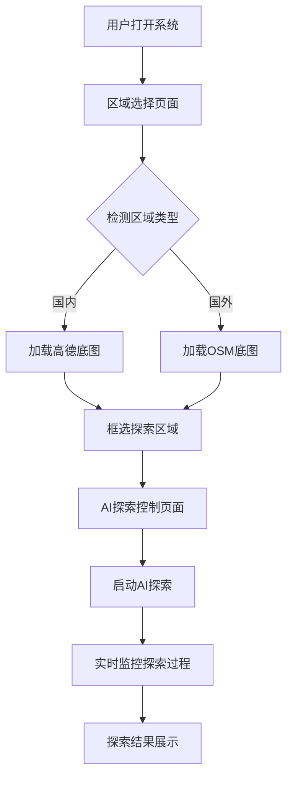

# AI地图探索系统 - 地图服务架构产品需求文档

## 1. 产品概述

本产品是AI地图探索系统的地图服务架构升级，旨在解决国内外地图底图服务差异化问题，实现智能化的地图服务选择和统一的坐标系管理。

- 核心目标：为AI地图探索系统提供全球范围内的地图底图服务支持，确保国内外区域都能正常显示地图底图和POI数据。
- 解决的问题：高德地图在国外无底图服务的限制，坐标系不统一导致的数据显示错误，以及地图服务切换的复杂性。
- 目标用户：AI研究人员、地理信息系统开发者、需要进行全球地图探索的用户。

## 2. 核心功能

### 2.1 用户角色

| 角色 | 使用方式 | 核心权限 |
|------|----------|----------|
| 系统管理员 | 直接访问系统配置 | 可配置地图服务参数、API密钥、区域边界设置 |
| 普通用户 | Web界面操作 | 可选择探索区域、启动AI探索、查看探索结果 |

### 2.2 功能模块

我们的地图服务架构需求包含以下主要页面：

1. **地图服务配置页面**：服务选择配置、API密钥管理、坐标系设置
2. **区域选择页面**：地图显示、区域框选、服务状态显示
3. **AI探索控制页面**：探索参数设置、实时状态监控、探索结果展示
4. **数据管理页面**：本地数据导入、数据格式转换、坐标系校验

### 2.3 页面详情

| 页面名称 | 模块名称 | 功能描述 |
|----------|----------|----------|
| 地图服务配置页面 | 服务选择器 | 自动检测区域类型，选择高德或OSM服务 |
| 地图服务配置页面 | API管理器 | 管理高德地图和OSM服务的API密钥和配置 |
| 地图服务配置页面 | 坐标系管理 | 统一坐标系设置，确保WGS84标准 |
| 区域选择页面 | 地图显示器 | 根据区域自动切换底图服务，支持缩放和平移 |
| 区域选择页面 | 区域框选工具 | 支持矩形框选，实时显示选中区域边界 |
| 区域选择页面 | 服务状态指示器 | 显示当前使用的地图服务类型和连接状态 |
| AI探索控制页面 | 探索参数设置 | 设置AI视野范围、移动速度、探索策略 |
| AI探索控制页面 | 实时监控面板 | 显示AI当前位置、探索路径、发现的POI |
| AI探索控制页面 | 探索结果展示 | 展示探索完成后的路径图、POI列表、决策记录 |
| 数据管理页面 | 本地数据导入器 | 导入shapefile格式的POI和道路数据 |
| 数据管理页面 | 数据格式转换器 | 转换不同格式的地理数据，统一坐标系 |
| 数据管理页面 | 坐标系校验器 | 验证数据坐标系正确性，自动修复坐标偏移 |

## 3. 核心流程

### 系统管理员流程
1. 配置地图服务参数和API密钥
2. 设置国内外区域边界判断规则
3. 验证地图服务连接状态
4. 监控系统运行状态

### 普通用户流程
1. 打开区域选择页面，系统自动加载合适的底图服务
2. 使用框选工具选择探索区域
3. 系统自动识别区域类型并切换相应的地图服务
4. 设置AI探索参数，启动探索任务
5. 实时观察AI探索过程和决策
6. 查看探索结果和生成的心理地图

## 4. 用户界面设计

### 4.1 设计风格

- **主色调**：深蓝色(#1E3A8A)和浅蓝色(#3B82F6)，体现科技感和专业性
- **辅助色**：绿色(#10B981)表示正常状态，橙色(#F59E0B)表示警告，红色(#EF4444)表示错误
- **按钮样式**：圆角矩形按钮，带有轻微阴影效果
- **字体**：中文使用微软雅黑，英文使用Roboto，主要字号14px-16px
- **布局风格**：左侧边栏+主内容区域的经典布局，支持响应式设计
- **图标风格**：使用简洁的线性图标，统一的视觉风格

### 4.2 页面设计概览

| 页面名称 | 模块名称 | UI元素 |
|----------|----------|---------|
| 地图服务配置页面 | 服务选择器 | 下拉选择框，状态指示灯，自动/手动切换开关 |
| 地图服务配置页面 | API管理器 | 输入框，保存按钮，连接测试按钮，状态显示区域 |
| 区域选择页面 | 地图显示器 | 全屏地图容器，缩放控件，图层切换按钮 |
| 区域选择页面 | 区域框选工具 | 框选按钮，清除按钮，坐标显示框，确认按钮 |
| AI探索控制页面 | 探索参数设置 | 滑块控件，数值输入框，预设选项按钮组 |
| AI探索控制页面 | 实时监控面板 | 状态卡片，进度条，实时数据表格，地图叠加层 |
| 数据管理页面 | 本地数据导入器 | 文件上传区域，拖拽提示，进度条，结果反馈 |

### 4.3 响应式设计

- **桌面优先设计**：主要针对桌面端使用，支持大屏幕显示
- **移动端适配**：侧边栏可折叠，地图支持触摸操作
- **触摸优化**：按钮和交互元素适合触摸操作，最小44px点击区域