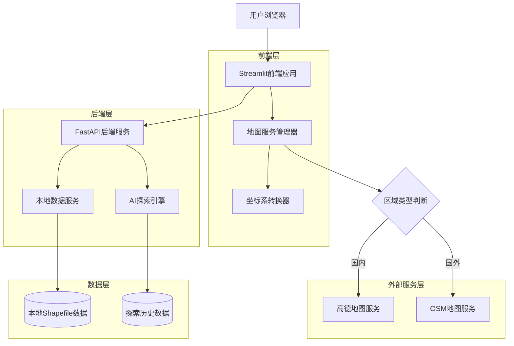
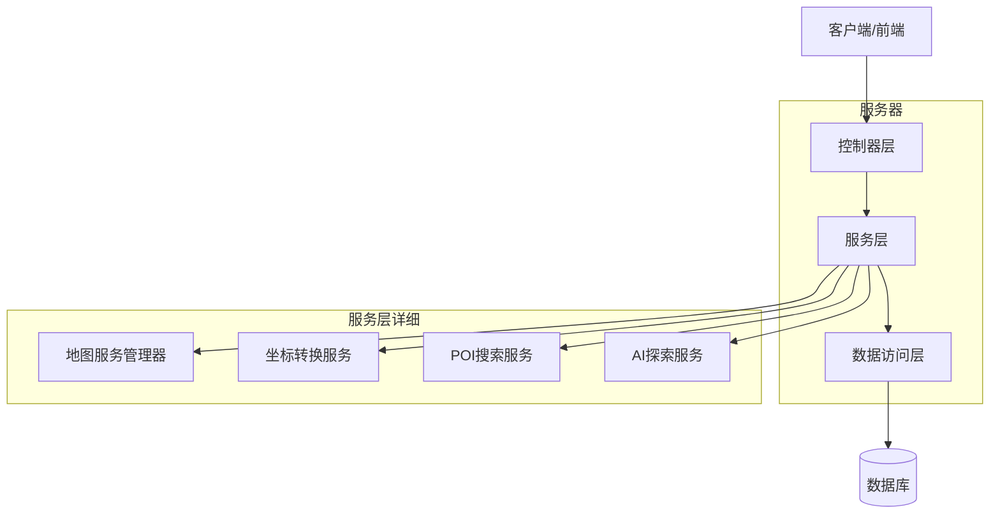
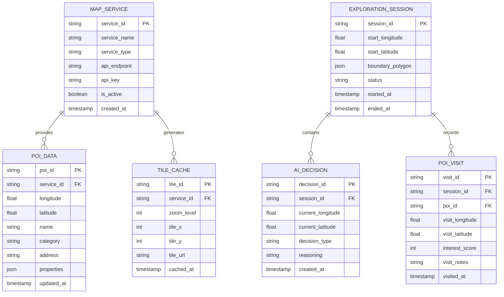

# AI地图探索系统 - 地图服务架构技术文档

## 1. 架构设计



## 2. 技术描述

- **前端**: Streamlit@1.28.0 + Folium@0.15.0 + Plotly@5.17.0
- **后端**: FastAPI@0.104.0 + Uvicorn@0.24.0
- **AI框架**: LangChain@0.0.350 + DashScope@1.14.0
- **地理数据处理**: GeoPandas@0.14.0 + Pandas@2.1.0
- **HTTP客户端**: Requests@2.31.0 + aiohttp@3.9.0
- **地图服务**: 高德地图API + OpenStreetMap API

## 3. 路由定义

| 路由 | 用途 |
|------|-----|
| /home | 主页面，显示地图和控制面板 |
| /config | 地图服务配置页面，管理API密钥和服务设置 |
| /explore | AI探索控制页面，设置探索参数和监控过程 |
| /data | 数据管理页面，导入和管理本地地理数据 |
| /results | 探索结果页面，展示AI探索的成果和分析 |

## 4. API定义

### 4.1 地图服务API

**区域类型检测**
```
POST /api/map/detect-region
```

请求参数:
| 参数名称 | 参数类型 | 是否必需 | 描述 |
|----------|----------|----------|------|
| longitude | float | true | 经度坐标 |
| latitude | float | true | 纬度坐标 |

响应参数:
| 参数名称 | 参数类型 | 描述 |
|----------|----------|------|
| region_type | string | 区域类型：domestic/international |
| map_service | string | 推荐的地图服务：amap/osm |

示例:
```json
{
  "longitude": 116.397128,
  "latitude": 39.916527,
  "region_type": "domestic",
  "map_service": "amap"
}
```

**获取底图瓦片URL**
```
GET /api/map/tiles/{service_type}
```

请求参数:
| 参数名称 | 参数类型 | 是否必需 | 描述 |
|----------|----------|----------|------|
| service_type | string | true | 服务类型：amap/osm |
| z | int | true | 缩放级别 |
| x | int | true | 瓦片X坐标 |
| y | int | true | 瓦片Y坐标 |

响应参数:
| 参数名称 | 参数类型 | 描述 |
|----------|----------|------|
| tile_url | string | 瓦片图片URL |

**POI搜索API**
```
POST /api/map/poi/search
```

请求参数:
| 参数名称 | 参数类型 | 是否必需 | 描述 |
|----------|----------|----------|------|
| service_type | string | true | 服务类型：amap/osm |
| longitude | float | true | 中心点经度 |
| latitude | float | true | 中心点纬度 |
| radius | int | true | 搜索半径（米） |
| keywords | string | false | 搜索关键词 |

响应参数:
| 参数名称 | 参数类型 | 描述 |
|----------|----------|------|
| pois | array | POI列表 |
| total_count | int | 总数量 |

### 4.2 坐标转换API

**坐标系转换**
```
POST /api/coordinate/transform
```

请求参数:
| 参数名称 | 参数类型 | 是否必需 | 描述 |
|----------|----------|----------|------|
| coordinates | array | true | 坐标点数组 |
| source_crs | string | true | 源坐标系 |
| target_crs | string | true | 目标坐标系 |

响应参数:
| 参数名称 | 参数类型 | 描述 |
|----------|----------|------|
| transformed_coordinates | array | 转换后的坐标数组 |
| success | boolean | 转换是否成功 |

## 5. 服务器架构图



## 6. 数据模型

### 6.1 数据模型定义



### 6.2 数据定义语言

**地图服务表 (map_services)**
```sql
-- 创建表
CREATE TABLE map_services (
    service_id VARCHAR(50) PRIMARY KEY,
    service_name VARCHAR(100) NOT NULL,
    service_type VARCHAR(20) NOT NULL CHECK (service_type IN ('amap', 'osm')),
    api_endpoint VARCHAR(255),
    api_key VARCHAR(255),
    is_active BOOLEAN DEFAULT true,
    created_at TIMESTAMP WITH TIME ZONE DEFAULT NOW()
);

-- 创建索引
CREATE INDEX idx_map_services_type ON map_services(service_type);
CREATE INDEX idx_map_services_active ON map_services(is_active);

-- 初始化数据
INSERT INTO map_services (service_id, service_name, service_type, api_endpoint, is_active) VALUES
('amap_001', '高德地图服务', 'amap', 'https://restapi.amap.com/v3', true),
('osm_001', 'OpenStreetMap服务', 'osm', 'https://nominatim.openstreetmap.org', true);
```

**POI数据表 (poi_data)**
```sql
-- 创建表
CREATE TABLE poi_data (
    poi_id VARCHAR(50) PRIMARY KEY,
    service_id VARCHAR(50) REFERENCES map_services(service_id),
    longitude DECIMAL(10, 7) NOT NULL,
    latitude DECIMAL(10, 7) NOT NULL,
    name VARCHAR(200) NOT NULL,
    category VARCHAR(100),
    address TEXT,
    properties JSONB,
    updated_at TIMESTAMP WITH TIME ZONE DEFAULT NOW()
);

-- 创建索引
CREATE INDEX idx_poi_data_location ON poi_data(longitude, latitude);
CREATE INDEX idx_poi_data_service ON poi_data(service_id);
CREATE INDEX idx_poi_data_category ON poi_data(category);
```

**瓦片缓存表 (tile_cache)**
```sql
-- 创建表
CREATE TABLE tile_cache (
    tile_id VARCHAR(100) PRIMARY KEY,
    service_id VARCHAR(50) REFERENCES map_services(service_id),
    zoom_level INTEGER NOT NULL,
    tile_x INTEGER NOT NULL,
    tile_y INTEGER NOT NULL,
    tile_url VARCHAR(500),
    cached_at TIMESTAMP WITH TIME ZONE DEFAULT NOW()
);

-- 创建索引
CREATE INDEX idx_tile_cache_coords ON tile_cache(service_id, zoom_level, tile_x, tile_y);
CREATE INDEX idx_tile_cache_time ON tile_cache(cached_at);
```

**探索会话表 (exploration_sessions)**
```sql
-- 创建表
CREATE TABLE exploration_sessions (
    session_id VARCHAR(50) PRIMARY KEY,
    start_longitude DECIMAL(10, 7) NOT NULL,
    start_latitude DECIMAL(10, 7) NOT NULL,
    boundary_polygon JSONB,
    status VARCHAR(20) DEFAULT 'active' CHECK (status IN ('active', 'paused', 'completed', 'failed')),
    started_at TIMESTAMP WITH TIME ZONE DEFAULT NOW(),
    ended_at TIMESTAMP WITH TIME ZONE
);

-- 创建索引
CREATE INDEX idx_exploration_sessions_status ON exploration_sessions(status);
CREATE INDEX idx_exploration_sessions_time ON exploration_sessions(started_at DESC);
```

**AI决策记录表 (ai_decisions)**
```sql
-- 创建表
CREATE TABLE ai_decisions (
    decision_id VARCHAR(50) PRIMARY KEY,
    session_id VARCHAR(50) REFERENCES exploration_sessions(session_id),
    current_longitude DECIMAL(10, 7) NOT NULL,
    current_latitude DECIMAL(10, 7) NOT NULL,
    decision_type VARCHAR(50) NOT NULL,
    reasoning TEXT,
    created_at TIMESTAMP WITH TIME ZONE DEFAULT NOW()
);

-- 创建索引
CREATE INDEX idx_ai_decisions_session ON ai_decisions(session_id);
CREATE INDEX idx_ai_decisions_time ON ai_decisions(created_at DESC);
```

**POI访问记录表 (poi_visits)**
```sql
-- 创建表
CREATE TABLE poi_visits (
    visit_id VARCHAR(50) PRIMARY KEY,
    session_id VARCHAR(50) REFERENCES exploration_sessions(session_id),
    poi_id VARCHAR(50) REFERENCES poi_data(poi_id),
    visit_longitude DECIMAL(10, 7) NOT NULL,
    visit_latitude DECIMAL(10, 7) NOT NULL,
    interest_score INTEGER CHECK (interest_score >= 1 AND interest_score <= 10),
    visit_notes TEXT,
    visited_at TIMESTAMP WITH TIME ZONE DEFAULT NOW()
);

-- 创建索引
CREATE INDEX idx_poi_visits_session ON poi_visits(session_id);
CREATE INDEX idx_poi_visits_poi ON poi_visits(poi_id);
CREATE INDEX idx_poi_visits_score ON poi_visits(interest_score DESC);
```