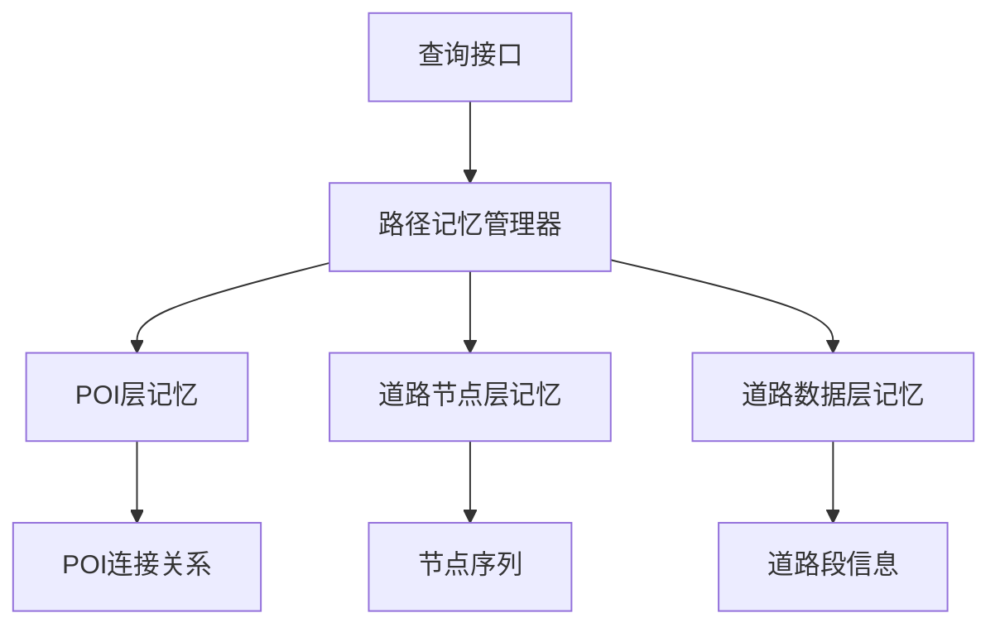
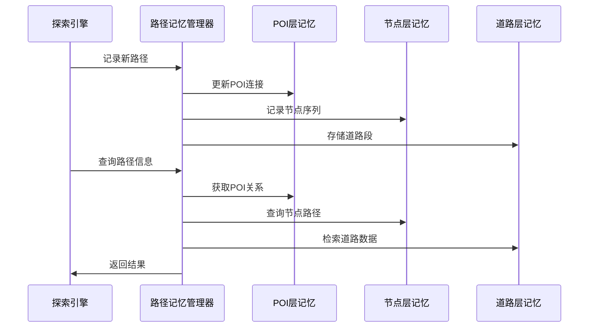
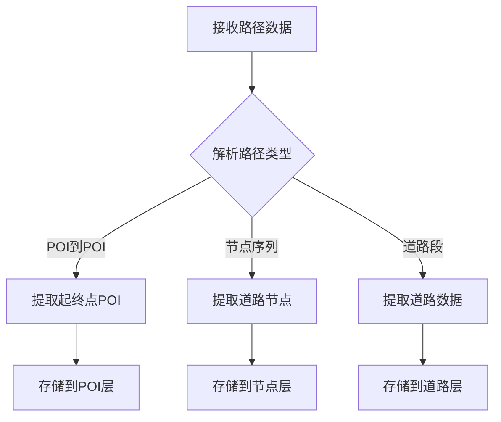
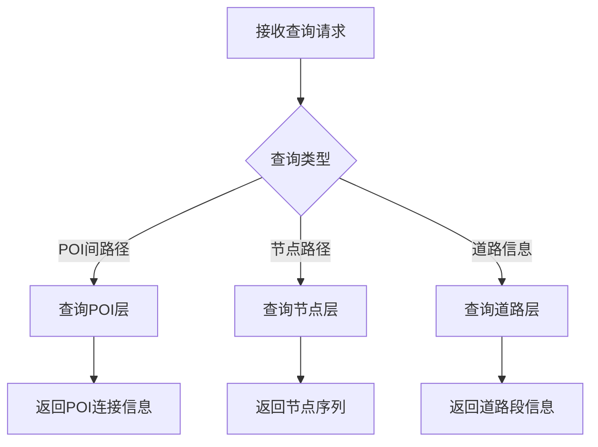

# AI路径记忆系统技术架构文档

## 1. 系统概述

### 1.1 设计理念

基于路径的三要素构建简化记忆系统：

* **POI层**：记忆起终点POI及其连接关系

* **道路节点层**：记忆中间节点和途径POI

* **道路数据层**：记忆基础道路段信息

### 1.2 核心目标

* 实现AI对路径信息的简单分层存储

* 支持基础路径查询功能

* 提供路径规划问题的回答能力

## 2. 系统架构设计

### 2.1 整体架构图



### 2.2 数据流架构



## 3. 核心组件设计

### 3.1 POI层记忆系统

#### 3.1.1 数据结构

```python
class POIMemoryLayer:
    def __init__(self):
        # POI间连接关系
        self.poi_connections = {
            "poi_a_id->poi_b_id": {
                "start_poi": POI对象,
                "end_poi": POI对象,
                "direct_distance": 直线距离,
                "actual_distance": 实际路径距离,
                "exploration_count": 探索次数,
                "last_updated": 最后更新时间
            }
        }
```

#### 3.1.2 核心方法

```python
def record_poi_connection(self, start_poi, end_poi, path_data):
    """记录POI间连接关系"""
    
def get_poi_distance(self, poi_a, poi_b):
    """获取POI间距离信息"""
```

### 3.2 道路节点层记忆系统

#### 3.2.1 数据结构

```python
class RoadNodeMemoryLayer:
    def __init__(self):
        # 节点序列记忆
        self.node_sequences = {
            "path_id": {
                "nodes": [节点ID列表],
                "coordinates": [[纬度, 经度]列表],
                "poi_waypoints": [途径POI列表],
                "total_distance": 总距离
            }
        }
```

#### 3.2.2 核心方法

```python
def record_node_sequence(self, path_id, nodes, poi_waypoints):
    """记录节点序列"""
    
def get_node_path(self, start_node, end_node):
    """获取节点路径"""
```

### 3.3 道路数据层记忆系统

#### 3.3.1 数据结构

```python
class RoadDataMemoryLayer:
    def __init__(self):
        # 道路段信息
        self.road_segments = {
            "segment_id": {
                "start_node": 起始节点,
                "end_node": 终止节点,
                "length": 道路长度,
                "road_type": 道路类型,
                "traversal_count": 通行次数
            }
        }
```

#### 3.3.2 核心方法

```python
def record_road_segment(self, segment_id, segment_data):
    """记录道路段信息"""
    
def get_road_info(self, segment_id):
    """获取道路信息"""
```

## 4. 路径记忆管理器

### 4.1 核心管理器设计

```python
class PathMemoryManager:
    def __init__(self):
        self.poi_layer = POIMemoryLayer()
        self.node_layer = RoadNodeMemoryLayer()
        self.road_layer = RoadDataMemoryLayer()
```

### 4.2 路径记录流程



### 4.3 路径查询流程



## 5. 接口设计

### 5.1 记忆存储接口

```python
# 路径记录接口
def record_exploration_path(self, path_data):
    """记录探索路径"""

def record_poi_visit(self, poi, access_info):
    """记录POI访问"""

def record_road_traversal(self, road_segments):
    """记录道路通行"""
```

### 5.2 查询接口

```python
# 路径查询接口
def query_poi_connection(self, poi_a, poi_b):
    """查询POI间连接"""

def query_node_path(self, path_id):
    """查询节点路径"""

def query_road_info(self, segment_id):
    """查询道路信息"""
```

## 6. 实施建议

### 6.1 开发阶段

1. **第一阶段**：实现基础三层记忆结构
2. **第二阶段**：开发基础查询接口
3. **第三阶段**：完善数据存储和检索功能

### 6.2 测试策略

* **单元测试**：各层记忆功能测试

* **集成测试**：跨层协作测试

* **功能测试**：路径存储和查询功能验证

### 6.3 部署考虑

* **内存管理**：合理的内存使用策略

* **持久化**：简单的数据持久化机制

* **监控**：基础的记忆系统状态监控

